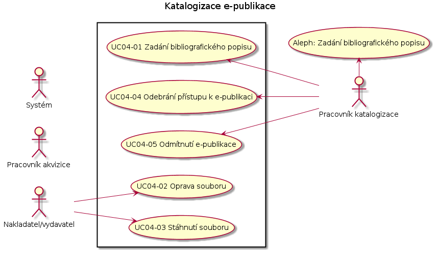

Případy užití
--------------------------------------

.. raw:: html

	

	
	<noscript>Please enable JavaScript to view the <a href="http://disqus.com/?ref_noscript">comments powered by Disqus.</a></noscript>
	<a href="http://disqus.com" class="dsq-brlink">comments powered by Disqus</a>
    

.. note::
   
   Registrace ISBN se bude dit pres jeden formular, i pro tistene knihy.
   Pak nakladatel pouziva jen jeden ISBN formular.
   Panu Zahorikovi se budou ukladat registrace stejne jako z puvodniho registracniho formulare.
   Nakladatel by pak mel usnadnenou praci, protoze pak by mel jen jedno misto na registraci ISBN.
   Panu Jerabkovi a p. Zahorikovi bude chodit do Alephu zprava.
      
 
.. note::

   zalozeni periodika

   Narodni technicka knihovna ma vlastni agenturu ISSN. Maji vlastni agenturu. Neni dohodnuta zadna sw komunikace s touto agenturou.
   V Alephu se objevi zaznam az kdyz prijde papirovy vytisk. Ten pracovnik vezme a vlozi do Alephu zaznam. i s ISSN.

.. note::

   pokracujici zdroj
   
   u zaznamu, co ma issn, bude k dispozici tlacitko "pridat". Tj. pridava se dalsi vytisk. Ten nema nove isbn a patri pod jeden hlavni zaznam.
  
.. note::

   UC05 - Doplneni bibliografickeho popisu
   - bibliografie potrebuje prohlizet po jednotlivych strankach
   - v zaznamu v Alephu bude proklik na nahled do e-deposit, podobne jako je proklik do krameria

   
UC01 Registrace nakladatele
...................................................

.. image:: uc01.png

UC01-01 Stažení smlouvy k vyplnění
~~~~~~~~~~~~~~~~~~~~~~~~~~~~~~~~~~~~~~
.. include:: uc01-01.rst

UC01-02 Registrace nakladatele/vydavatele
~~~~~~~~~~~~~~~~~~~~~~~~~~~~~~~~~~~~~~~~~~~~~~~
.. include:: uc01-02.rst

UC01-03 Pozastavení platnosti smlouvy s nakladatelem/vydavatelem
~~~~~~~~~~~~~~~~~~~~~~~~~~~~~~~~~~~~~~~~~~~~~~~~~~~~~~~~~~~~~~~~~~~~~~~~~
.. include:: uc01-03.rst

UC01-04 Detail účtu nakladatele/vydavatele
~~~~~~~~~~~~~~~~~~~~~~~~~~~~~~~~~~~~~~~~~~~~~~~~
.. include:: uc01-04.rst

UC02 Ohlášení publikace
...........................................

.. image:: uc02.png

UC02-01 Ohlášení jednoduché
~~~~~~~~~~~~~~~~~~~~~~~~~~~~~~
.. include:: uc02-01.rst

UC02-02 Ohlášení se soubory
~~~~~~~~~~~~~~~~~~~~~~~~~~~~~~
.. include:: uc02-02.rst

UC02-03 Ohlášení s tiskovou předlohou
~~~~~~~~~~~~~~~~~~~~~~~~~~~~~~~~~~~~~~~~~
.. include:: uc02-03.rst

UC02-04 Odeslání ohlášky
~~~~~~~~~~~~~~~~~~~~~~~~~~~
.. include:: uc02-04.rst

UC02-05 Odeslání ohlášky s registrací ISBN
~~~~~~~~~~~~~~~~~~~~~~~~~~~~~~~~~~~~~~~~~~~~~~~
.. include:: uc02-05.rst

UC02-06 Kontroly souboru
~~~~~~~~~~~~~~~~~~~~~~~~~~~~
.. include:: uc02-06.rst

UC02-07 Načtení metadat ze  souborů
~~~~~~~~~~~~~~~~~~~~~~~~~~~~~~~~~~~~~~~
.. include:: uc02-07.rst

UC02-08 Transformace souboru
~~~~~~~~~~~~~~~~~~~~~~~~~~~~~~~~
.. include:: uc02-08.rst

UC02-09 Vytvoření náhledu na soubor
~~~~~~~~~~~~~~~~~~~~~~~~~~~~~~~~~~~~~~~~~
.. include:: uc02-09.rst

UC02-10 Oprava souboru
~~~~~~~~~~~~~~~~~~~~~~~~~~~~
.. include:: uc02-10.rst

UC02-11 Stážení souboru
~~~~~~~~~~~~~~~~~~~~~~~~~~~~
.. include:: uc02-11.rst

UC02-12 Kontrola duplicity ISBN
~~~~~~~~~~~~~~~~~~~~~~~~~~~~~~~~~~~
.. include:: uc02-12.rst

UC02-13 Přidělení ISBN
~~~~~~~~~~~~~~~~~~~~~~~~
.. include:: uc02-13.rst

UC03 - Akvizice publikace
...............................................

.. image:: uc03.png

UC03-01 Předání metadat k importu do Aleph
~~~~~~~~~~~~~~~~~~~~~~~~~~~~~~~~~~~~~~~~~~~~~~~~
.. include:: uc03-01.rst

UC03-02 Kontrola ISBN
~~~~~~~~~~~~~~~~~~~~~~~~
.. include:: uc03-02.rst

UC03-03 Kontrola metadat
~~~~~~~~~~~~~~~~~~~~~~~~~~~
.. include:: uc03-03.rst

UC03-04 Přijetí e-publikace
~~~~~~~~~~~~~~~~~~~~~~~~~~~~~~~
.. include:: uc03-04.rst

UC03-05 Kontrola ISBN v souboru
~~~~~~~~~~~~~~~~~~~~~~~~~~~~~~~~~~~
.. include:: uc03-05.rst

UC03-06 Oprava souboru
~~~~~~~~~~~~~~~~~~~~~~~~~
.. include:: uc03-06.rst

UC03-07 Stáhnutí souboru
~~~~~~~~~~~~~~~~~~~~~~~~~~~~
.. include:: uc03-07.rst

UC03-08 Odebrání přístup k e-publikaci
~~~~~~~~~~~~~~~~~~~~~~~~~~~~~~~~~~~~~~~~~~~
.. include:: uc03-08.rst

UC03-09 Odmítnutí e-publikace
~~~~~~~~~~~~~~~~~~~~~~~~~~~~~~~~~~
.. include:: uc03-09.rst

UC03-10 Odstranění duplicity
~~~~~~~~~~~~~~~~~~~~~~~~~~~~~~~
.. include:: uc03-10.rst

UC04 - Katalogizace e-publikace
............................................................

UC04-01 Zadání bibliografických metadat
~~~~~~~~~~~~~~~~~~~~~~~~~~~~~~~~~~~~~~~~~~~~
.. include:: uc04-01.rst

UC04-02 Export do systému Kramerius
~~~~~~~~~~~~~~~~~~~~~~~~~~~~~~~~~~~~~~~~
.. include:: uc04-02.rst

UC04-03 Oprava souboru
~~~~~~~~~~~~~~~~~~~~~~~~~
.. include:: uc04-03.rst

UC04-04 Stáhnutí souboru
~~~~~~~~~~~~~~~~~~~~~~~~~~~~
.. include:: uc04-04.rst

UC04-05 Odebrání přístup k e-publikaci
~~~~~~~~~~~~~~~~~~~~~~~~~~~~~~~~~~~~~~~~~~~
.. include:: uc04-05.rst

UC04-06 Odmítnutí e-publikace
~~~~~~~~~~~~~~~~~~~~~~~~~~~~~~~~~
.. include:: uc04-06.rst

UC05 - Zpřístupnění e-publikace
...........................................................

UC06 - Dlouhodobá ochrana publikace
..................................................................

UC07 - Ohlašování pokračujícího zdroje
........................................................................

.. image:: uc07.png

UC07-01 Ohlášení nového dílu
~~~~~~~~~~~~~~~~~~~~~~~~~~~~~~~~
.. include:: uc07-01.rst

UC07-02 Ohlášení noveho dilu přes **ftp**
~~~~~~~~~~~~~~~~~~~~~~~~~~~~~~~~~~~~~~~~~~~~~~~
.. include:: uc07-02.rst

UC07-03 Ohlášení nového dílu přes **email**
~~~~~~~~~~~~~~~~~~~~~~~~~~~~~~~~~~~~~~~~~~~~~~~~~
.. include:: uc07-03.rst

UC08 - Akvizice pokračujícího zdroje
....................................................................

UC09 - Katalogizace pokračujícího zdroje
...........................................................................

UC10 - Zpřístupňování pokračujícího zdroje
...............................................................................

UC11 - Dlouhodobá ochrana pokračujícího zdroje
.......................................................................................

