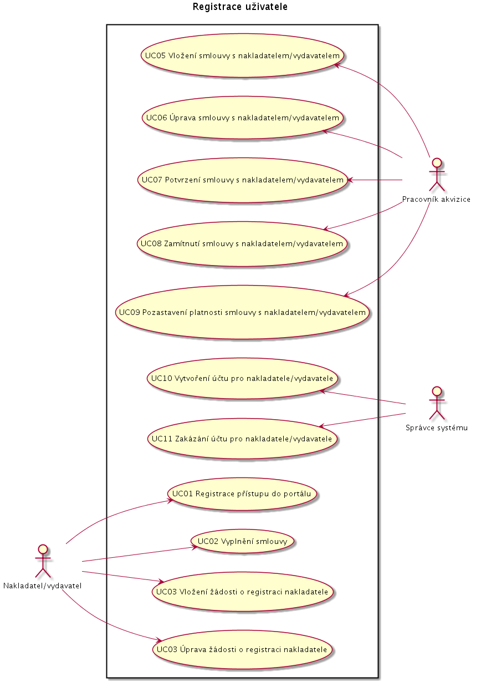
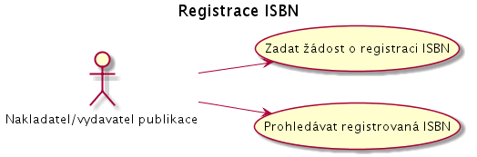

Případy užití
-------------

Registrace uživatele
....................

UC01 Registrace přístupu do portálu
~~~~~~~~~~~~~~~~~~~~~~~~~~~~~~~~~~~

*účastníci*:

- Nakladatel/vydavatel publikace

*vstupní podmínky*:

*tok událostí*:

1. Nakladatel/vydavatel zobrazí web stránku http://www.e-deposit.cz
2. Systém zobrazí úvodní stránku

   - představení
   - dokumentace
   - registrace  

3. Nakladatel/vydatavel klikne na linku "Zaregistrovat"
4. Nakladatel/vydavatel zadá přihlašovací údaje
5. Systém zobrazí uvítací stránku

*následné podmínky*:

UC02 Vyplnění smlouvy
~~~~~~~~~~~~~~~~~~~~~

*účastníci*:

- Nakladatel/vydavatel publikace

*vstupní podmínky*:

- Nakladatel/vydavatel provedl registraci přístupu do portálu.

*tok událostí*:

1. Nakladatel/vydavatel zobrazí web stránku http://www.e-deposit.cz
2. Systém zobrazí úvodní stránku

   - představení
   - dokumentace
   - registrace
   - přihlášení  

3. Nakladatel/vydatavel klikne na linku "Přihlásit se"
4. Nakladatel/vydavatel zadá přihlašovací údaje
5. Systém zobrazí uvítací stránku s volbami:

      - "zadat číslo smlouvy"
      - "podepsat smlouvu"

6. nakladatel/vydavatel klikne na "podepsat smlouvu"

   1. systém zobrazí formulář na vyplnění údajů
   2. nakladatel/vydavatel vyplní údaje o sobě:

      - to jsou údaje, co budou na smlouvě

   3. nakladatel/vydavatel odešle formulář
   4. systém vytvoří smlouvu k podpisu

      - použije údaje, co nakladatel/vydavatel vložil

   5. Nakladatatel/vydavatel si smlouvu stáhne a podepíše ji
   6. Nakladatatel/vydavatel smlouvu odnese do NKP

*následné podmínky*:

- systém obsahuje smlouvu čekající k podpisu

UC03 Vložení žádosti o registraci nakladatele/vydavatele
~~~~~~~~~~~~~~~~~~~~~~~~~~~~~~~~~~~~~~~~~~~~~~~~~~~~~~~~

*účastníci*:

- Nakladatel/vydavatel publikace

*vstupní podmínky*:

- Nakladatel/vydavatel je přihlášený do portálu
- Nakladatel/vydavatel podepsal smlouvu s NKP o zpřístupnění e-publikací.
- Pracovník akvizice smlouvu potvrdil

*tok událostí*:

1. Systém zobrazí uvítací stránku

   - číslo smlouvy, pokud je již zadané
   - přehled vložených žádostí o registraci

6. Pokud nemá uživatel zadané číslo smlouvy

   1. systém zobrazí dialog s volbami

      - "zadat číslo smlouvy"
      - "podepsat smlouvu"

   2. KDYŽ nakladatel/vydavatel klikne na "zadat číslo smlouvy"

      1. systém zobrazí dialog na zadání čísla smlouvy

   3. KDYŽ nakladatel/vydavatel klikne na "podepsat smlouvu"

      1. systém zobrazí

	 - postup, jak podepsat smlouvu
	 - linku s prázdnou smlouvou

      2. Nakladatatel/vydavatel si smlouvu stáhne a vyplní ji
      3. Nakladatatel/vydavatel smlouvu odnese do NKP

7. Systém zobrazí dialog pro zadání čísla smlouvy
8. Nakladatel/vydavatel zadá číslo smlouvy
9. Systém zobrazí přehled odeslaných žádost o registraci
10. Nakladatel/vydavatel klikne na linku "Nová žádost o registraci uživatele"
11. Systém zobrazí formulář a vyzve k vyplnění
12. Nakladatel/vydavatel publikace vyplní:

   - přihlašovací jméno, pod kterým chce vystupovat
   - role, jaké mají být uživateli přiřazeny  
   - email, na který mají přijít přihlašovací údaje

13. Nakladatel/vydatavel publikace klikne na tlačítko "Odeslat žádost"
14. Systém zobrazí informaci o přijetí žádosti a o tom, že pošle email s výsledky

   - zobrazí také linku s uloženou žádostí
   - zobrazí tlačítko "Hotovo" a "Další žádost o registraci"  

*následné podmínky*:

- systém obsahuje min. jednu žádost o registraci uživatele

UC02 Úprava žádosti o registraci uživatele

*účastníci*:

- Nakladatel/vydavatel publikace

*vstupní podmínky*:

- Nakladatel/vydavatel vložil do systému žádost o registraci uživatele.

*tok událostí*:

1. Nakladatel/vydavatel publikace klikne na linku "Moje žádosti o registraci uživatele"
2. Systém zobrazí formulář a vyzve k vyplnění
3. Nakladatel/vydavatel publikace vyplní:

   - číslo smlouvy
   - přihlašovací jméno, pod kterým chce vystupovat
   - email, na který mají přijít přihlašovací údaje

4. Nakladatel/vydatavel publikace klikne na tlačítko "Odeslat žádost"
5. Systém zobrazí informaci o přijetí žádosti a o tom, že pošle email s výsledky

   - zobrazí také linku s uloženou žádostí

*následné podmínky*:

- systém obsahuje žádost o registraci uživatele

Registrace ISBN
................

