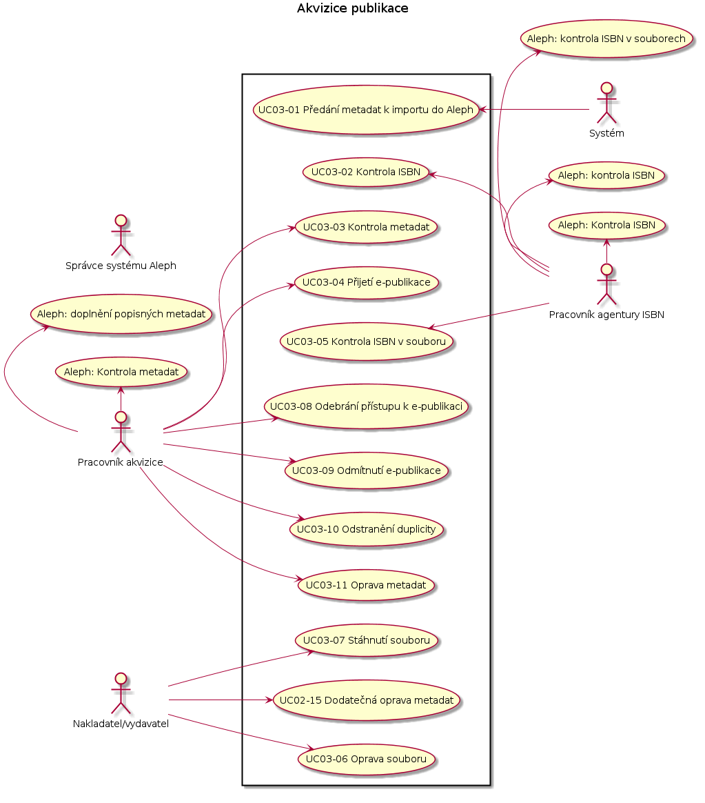

Případy užití
-------------

UC01 Registrace uživatele
..........................

.. image:: uc01.png

.. include:: uc01-01.rst
.. include:: uc01-02.rst
.. include:: uc01-03.rst

UC02 Registrace ISBN
....................

.. image:: uc02.png

.. include:: uc02-01.rst
.. include:: uc02-02.rst

UC03 - Zadávání elektronické knihy
.................................

.. include:: uc03-01.rst
.. include:: uc03-02.rst
.. include:: uc03-03.rst
.. include:: uc03-04.rst
.. include:: uc03-05.rst
.. include:: uc03-06.rst

.. U04 - Přijetí elektronické knihy
.. .................................

.. .. image:: uc04.png

.. .. include:: uc04-01.rst
.. .. include:: uc04-02.rst
.. .. include:: uc04-03.rst
.. .. include:: uc04-04.rst
.. .. include:: uc04-05.rst

.. U05 - Zpracování elektronické knihy
.. ....................................

.. .. image:: uc05.png

.. .. include:: uc05-01.rst
.. .. include:: uc05-02.rst
.. .. include:: uc05-03.rst
.. .. include:: uc05-04.rst
.. .. include:: uc05-05.rst

.. U06 - Přijetí opravy elektronické knihy
.. ........................................

.. .. image:: uc06.png

.. .. include:: uc06-01.rst
.. .. include:: uc06-02.rst
.. .. include:: uc06-03.rst
.. .. include:: uc06-04.rst
.. .. include:: uc06-05.rst

.. U07 - Zpracování opravy elektronické knihy
.. ...........................................

.. .. image:: uc07.png

.. .. include:: uc07-01.rst
.. .. include:: uc07-02.rst
.. .. include:: uc07-03.rst
.. .. include:: uc07-04.rst
.. .. include:: uc07-05.rst

